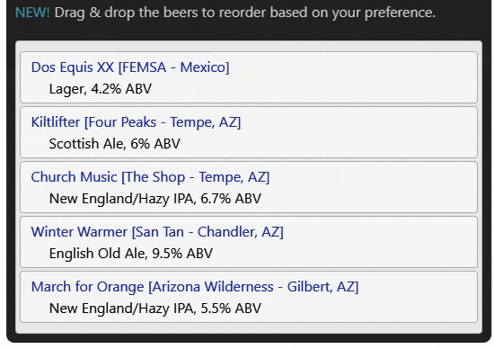

# Wasp
   

[![Travis][build-badge]][build]
[![npm package][npm-badge]][npm]
[![Coveralls][coveralls-badge]][coveralls]

Describe wasp here.

[build-badge]: https://img.shields.io/travis/user/repo/master.png?style=flat-square
[build]: https://travis-ci.org/user/repo

[npm-badge]: https://img.shields.io/npm/v/npm-package.png?style=flat-square
[npm]: https://www.npmjs.org/package/npm-package

[coveralls-badge]: https://img.shields.io/coveralls/user/repo/master.png?style=flat-square
[coveralls]: https://coveralls.io/github/user/repo 

Wasp is a simple wrapper around the [react-beautiful-dnd](https://github.com/atlassian/react-beautiful-dnd) library to provide drag & drop capabilities for a vertical list.  This component allows you to reuse the same functionality across multiple apps without needing to duplicate logic, styling, etc.  Follow the directions below and you'll have drag & drop functionality set up in less than 5 minutes!




## :hammer: Installation
Wasp is available through the [npm registry](https://www.npmjs.com/). It can be installed using the [`npm`](https://docs.npmjs.com/getting-started/installing-npm-packages-locally) or [`yarn`](https://yarnpkg.com/en/) command line tool.

```sh
# Yarn 
yarn add @joshcaplin/wasp
# NPM 
npm install --save @joshcaplin/wasp 
```
## :sunglasses: Usage
- There is one required parameter:
  -  **itemsToList** - input array of strings or objects to display in the list.  The objects should have properties of *title* and *description*.
- There is currently one optional parameter, with more coming soon:
  -  **onReorder()** - called every time you reorder the list - passes the new array back to the parent component.  If you don't care about the reordered array, you don't need to define a handler for this callback.
- **Live demo >>>** [codesandbox.io](https://codesandbox.io/s/wasp-demo-9q4y1)

```javascript
import { Wasp } from '@joshcaplin/wasp';
  ...
  ...
//items can be hardcoded, pulled from a config file, returned from an API call, etc
const teams = [
  'Purdue Boilermakers', 
  'Arizona State Sun Devils', 
  'Scottsdale Fighting Artichokes',
];
<Wasp
  itemsToList={teams}
  //onReorder={handleReorderedItems}  //<-- enable if you need the updated array
/>
```

## :raising_hand_man: Frequently asked questions
- **Should I use this library or react-beautiful-dnd?**
  - Unless this library has the exact functionality & styling that you're looking for, you should probably use react-beautiful-dnd in your app since it has additional capabilities.  You'll need to do the setup yourself, but you can use the source code here as a guide.  
- **Why did you create this library?**
  - Mostly as a proof-of-concept to understand the process of publishing an npm package and to learn how to build reusable React component libraries.
- **Why the heck is the library named Wasp?**
  - It stands for **W**icked **A**wesome **S**ortable **P**anel.
- **I don't like the default styling**
  - Please rephrase in the form of a question. :stuck_out_tongue_winking_eye:


## 🧱 Built with
- [react-beautiful-dnd](https://github.com/atlassian/react-beautiful-dnd)
  - built by Atlassian, **rbd** provides many options & flexibility for drag & drop functionality.
- [nwb](https://github.com/insin/nwb)
  - nwb is a toolkit to build reusable React *component* libraries rather than  full-blown React apps.


## :heart: Show your support
- If this library was helpful to you, please ⭐️ this repo!


## :writing_hand: Author
Josh Caplin - [@joshcaplin](https://twitter.com/joshcaplin)
- [www.joshcaplin.dev](https://www.joshcaplin.dev)&nbsp;&nbsp;&nbsp;


